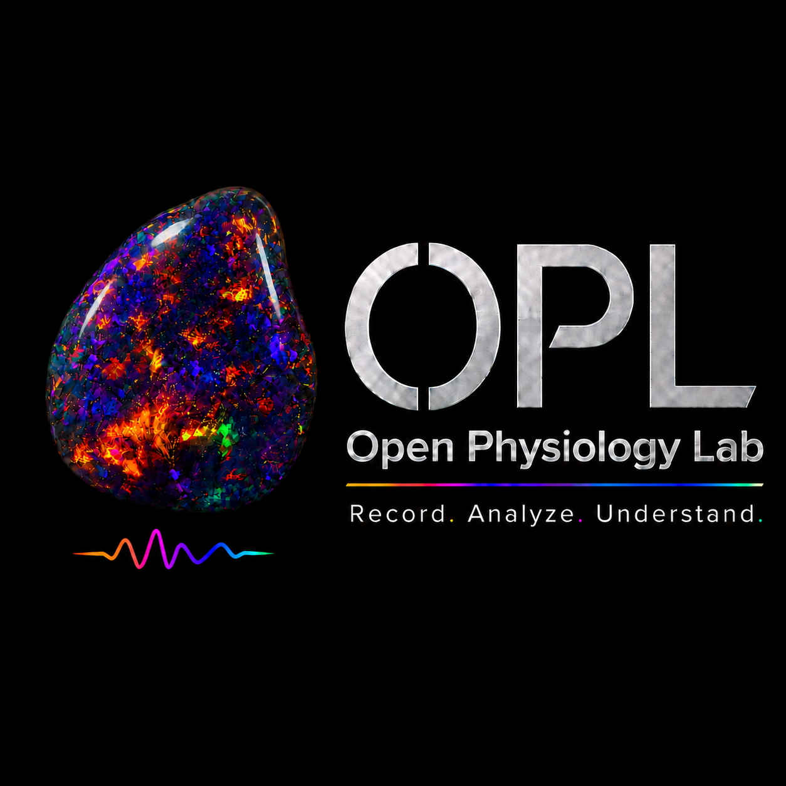

<p align="center">
  
</p>

# OpenPhysiologyLab

**Record. Analyse. Understand.**

OpenPhysiologyLab is an open-source physiology teaching and research prototype for recording, analysing, documenting, and comparing physiological signals.

The current **v0.1-alpha** release focuses on an ECG-like workflow using NPG Lite over USB serial.

This project is intended for education, experimentation, validation, and open physiology workflows.

New users should begin with docs/start_here.md.

**OpenPhysiologyLab is not a diagnostic medical device.**

---

## Current v0.1-alpha scope

OpenPhysiologyLab v0.1-alpha currently supports:

* ECG-like recording from NPG Lite over USB serial
* one-channel acquisition
* ECG headroom test
* resting ECG / basic RR analysis workflow
* raw CSV recording
* metadata storage
* filtering for review and analysis
* R-peak detection
* manual peak correction
* heart rate and RR interval analysis
* basic HRV-style metrics
* results dashboard
* comparison of saved analysis reports
* machine/session evaluation for ADC headroom and clipping

The first release is deliberately narrow. A focused workflow that works is better than a large unfinished platform.

---

## Main workflow

The v0.1-alpha workflow is:

1. Choose ECG setup in the Setup tab
2. Record ECG-like signal in the Recorder tab
3. Analyse R peaks and RR intervals in the Analysis tab
4. View saved results in the Results tab
5. Compare saved reports in the Compare tab
6. Review machine/session status in the Machine tab

---

## Electrode configuration

The current practical ECG configuration is:

| Body location    | NPG Lite input   |
| ---------------- | ---------------- |
| Right wrist / RA | A0P / CH input P |
| Left leg / LL    | A0N / CH input N |
| Right leg / RL   | REF / GND        |

This is documented as:

**RA-LL limb ECG / Lead-II-like**

This wording is intentional. The current workflow is not claimed to be certified diagnostic Lead II ECG.

---

## Platform status

Current platform status:

* Windows 11: tested
* macOS: expected to work, not yet fully tested
* Linux: expected to work, not yet fully tested

The first tested development setup uses Python on Windows 11.

---

## Installation on Windows

For detailed Windows installation instructions, see:

- docs/installation_windows.md

This guide gives two options:

1. Manual installation
2. ChatGPT-assisted step-by-step installation for beginners

For launch instructions, see docs/launching_openphysiologylab.md.

Clone or download the repository.

Open Command Prompt and go to the software folder:

```bat
cd /d path\to\OPL\software\OpenPhysiologyLab
```

Install dependencies:

```bat
python -m pip install -r requirements.txt
```

Launch:

```bat
python openphysiolab.py
```

Alternatively, double-click:

```bat
launch_openphysiologylab.bat
```

A local machine-specific launcher may also be present during development, but users should prefer the generic launcher when possible.

---

## Requirements

The Python requirements are listed in:

```text
software/OpenPhysiologyLab/requirements.txt
```

Main dependencies:

* PyQt5
* pyqtgraph
* numpy
* pandas
* scipy
* pyserial

---

## Walkthroughs

Begin with the walkthroughs in:

```text
docs/walkthroughs/
```

Recommended order:

1. `first_ecg_recording.md`
2. `analogue_to_digital_ecg.md`
3. `ecg_validation_workflow.md`

These documents are written as different entry points into the same workflow, not as rigid audience categories.

---

## Hardware compatibility

OpenPhysiologyLab v0.1-alpha currently targets NPG Lite over USB serial.

NPG Lite is developed by Upside Down Labs.

For hardware details and purchase links, see docs/hardware_npg_lite.md.

For NPG Lite firmware upload instructions, see docs/firmware_flashing_npg_lite.md.

OpenPhysiologyLab is an independent project and is not officially affiliated with or endorsed by Upside Down Labs unless explicitly stated.

Do not use the Upside Down Labs name, logo, or branding in a way that implies official endorsement.

---

## Data and reproducibility

OpenPhysiologyLab saves recordings as folders containing files such as:

* raw CSV data
* metadata
* analysis reports
* machine/session evaluation information

The raw data should remain unchanged. Filtering, display inversion, and analysis should not overwrite raw recordings.

---

## Safety and interpretation warning

OpenPhysiologyLab is not a diagnostic medical device.

Do not use it to:

* diagnose disease
* guide treatment
* replace certified ECG equipment
* make emergency medical decisions

Use it for:

* physiology teaching
* open experimentation
* signal validation
* research prototyping
* low-cost educational workflows

---

## Roadmap

Planned future directions include:

* stronger ECG validation workflows
* ECG simulator support
* improved cross-platform testing
* EMG workflow
* EOG workflow
* multi-channel acquisition
* EEG demonstration workflows
* better packaging and installation
* hardware documentation
* validation datasets

---

## License

This project is released under the GNU General Public License v3.0.

See:

```text
LICENSE
```

---

## Project philosophy

Physiology should not be locked behind expensive black boxes.

OpenPhysiologyLab aims to make the recording chain visible: electrode, machine, raw data, analysis, report, and interpretation.

The goal is not only to record signals.

The goal is to understand them.


Created and maintained by Dr Deepak S.

